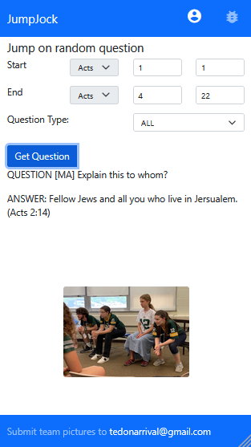
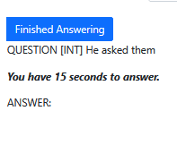
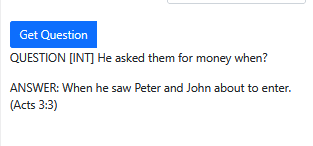

# quizService
This project is meant to decouple quiz "data" from the user-experience.

## JumpJock

Quizzers prepare for practices and meets in many ways.  They read and study God's word
and the material.  They work on memorization using various approaches and techniques.
They review the questions from the quizzing database meant for practices.

But how do they actually train to jump on a question?  How do they condition reflexes to
respond within a few syllables to God's Word they have planted?  They might have parents
or siblings or friends who will quiz them on questions.  Others may just have to wait until
practice and the bench itself.  But what if there was a tool that parents, siblings, and friends could use to help 
quizzers practice; one that quizzers themselves could use? 

JumpJock is a self-study tool providing questions at a metered pace, allowing
quizzers to "jump", interrupting the question, and try to answer on their own.
This is meant to help quizzers build their skills and confidence in jumping.  Its also a convenient
way for family, friends, or themselves to have easy access to practice questions from anywhere, at any time.

JumpJock is one more way to help quizzers call to mind God's word when they need it.  It's also useful to me as a parent to help ask my quizzer questions (even of their specialty) without having to print out questions!

## Jumping on a Question

After a quizzer has "jumped" on a question after only a few words.  He has time to work out the question, or jump to the Answer to check if they were right.

## Seeing the answer

The full question and answer are finally revealed, including the reference.  We're ready to start again!

 |

## Ready to try it?

Go to https://trueword.freehostia.com/, then select JumpJock.  Register and try it out!

### API
The application programming interface (API) allows access to questions
through a couple of means:

 - random question: by providing a starting and an ending verse,
   a random question within that range is returned.  Optionally, 
   the question type can be provided.
 - question index: this is a numerical index of the question based
   on the database provided by the CQLT.
 
   
